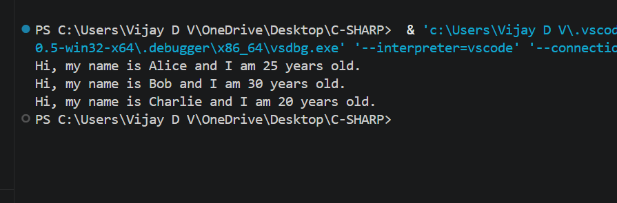

## Simple Object-Oriented Programming (OOP)Objective:Requirements:

    - Create a `Person` class with properties and methods.
    - Define properties such as `Name` and `Age`.
    - Implement a method `Introduce()` that prints a personalized greeting.
    - Instantiate a few `Person` objects in your `Main` method and call `Introduce()` on each.

### feedback changes

### 1. Use classes across different files and observe accessibility differences

- Same file means everything mixed and hard to read as project grows, Different files means each class in its own file clean and modular structure.

- Same file means difficult to maintain and debug changes, Different files means easy to update and manage each class independently.

- Same file means hard to reuse classes in other parts or projects, Different files means classes can be easily reused and shared.

### 2. why companies uses oops

- OOP helps organize large codebases into clear structures, making projects easier to understand.
  
- It improves maintainability, so companies can update or fix features without breaking the whole system
  
- Code reusability reduces development time and cost by using existing components
  
- It enables teamwork, so multiple developers can work on different parts of the system independently and It makes testing and debugging easier.

### 3. access specifiers

- public allows access from anywhere in the program
- private restricts access only within the same class
- protected allows access within the class and its derived (child) classes
- internal allows access only within the same project

- 
