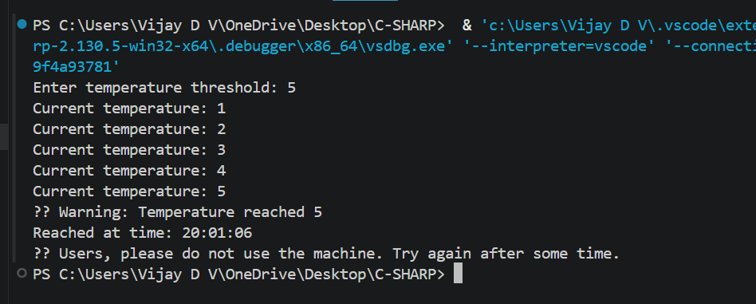

### Delegates, Events, and Basic Event HandlingObjective:Requirements:

    - Build a console-based event-driven application (e.g., a counter that triggers an event at a threshold).
    - Define a delegate and an event that fires when a counter reaches a specific value.
    - Create multiple event handler methods that perform actions when the event is raised.
    - In your main loop, increment the counter and raise the event when appropriate.
    - Demonstrate how events can decouple the producer and consumer logic.

### Why protected virtual is used ?
- protected ensures event triggering is controlled and not accessible from outside classes
- virtual allows derived classes to customize how the event is raised
- It follows best practice to separate event logic from business logic

### Delegates and Events 
- Delegate defines a method signature (like a contract for methods)
- Event is a mechanism that uses delegates to notify when something happens
- A class (publisher) raises an event
- Other methods (subscribers) listen and react
  
### Output

