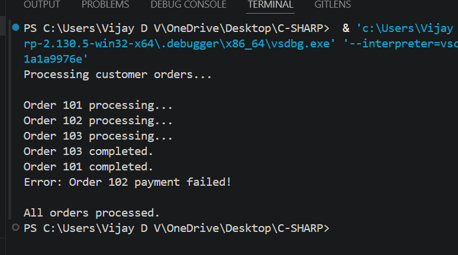

### Asynchronous Programming and Multi-threadingObjective:Requirements

- Develop a console application that performs multiple asynchronous operations concurrently.
- Use `async` and `await` to fetch data from multiple simulated sources (e.g., using `Task.Delay` to mimic API calls).
- Aggregate the results once all tasks are complete.
- Handle exceptions that may occur during asynchronous operations.

### Handle multiple (e.g., 10 users) concurrent CRUD requests on the same database table Implement using async and await

- Accept requests from multiple users (API or service layer)
- For each request:
  Use async methods for database operations (like Create, Read, Update, Delete)
  Example: async DB calls instead of synchronous ones
- When a request hits:
  It starts execution
  If it waits for DB (I/O operation), it releases the thread
  Other user requests can use that thread
- How Concurrency is Handled
  Multiple requests run in parallel (logically) using async
  Thread is not blocked, improving performance
  Database handles multiple connections internally

### Output

